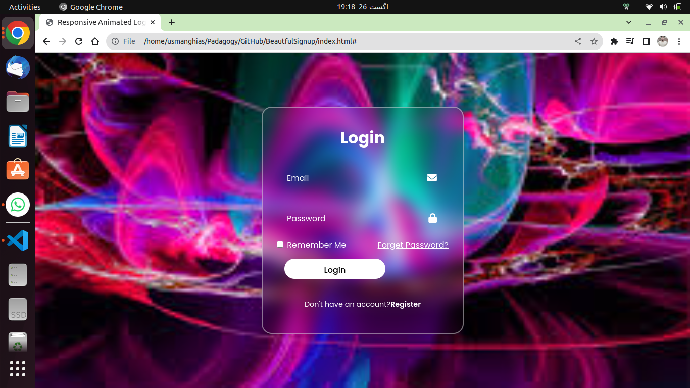

# Beautiful Signup Form



A beautifully designed responsive signup form.

## Live Demo

Check out the [live demo](https://usmanghias.github.io/BeautfulSignup/).

## Table of Contents

- [Introduction](#introduction)
- [Features](#features)
- [Installation](#installation)
- [Usage](#usage)
- [Contributing](#contributing)
- [License](#license)

## Introduction

This project is a showcase of a responsive and visually appealing signup form. It utilizes modern CSS techniques for styling and layout.

## Features

- Responsive design
- Background animation
- Stylish form elements
- ...

## Installation

To run this project locally, follow these steps:

1. Clone this repository:

   ```sh
   git clone https://github.com/UsmanGhias/BeautfulSignup.git

Open the index.html file in your web browser.
## Usage
Simply fill in the required fields and click the "Sign Up" button to see the form in action.

## Contributing
Contributions are welcome! If you have any ideas, improvements, or bug fixes, please open an issue or submit a pull request.

## License
This project is licensed under the MIT License.
